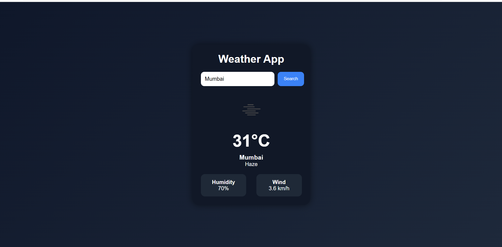

# 🌦️ Weather App

A modern and responsive Weather Application built using **HTML**, **CSS**, and **JavaScript** with real-time weather data from the **OpenWeather API**.

---

## 🚀 Features

✅ Search weather by city name  
✅ Real-time temperature updates  
✅ Humidity information  
✅ Wind speed details  
✅ Dynamic weather icons  
✅ Responsive design  
✅ Modern dark UI  

---

## 🛠️ Technologies Used

- HTML5
- CSS3
- JavaScript
- OpenWeather API

---

## 📸 Project Screenshot

---

## 🌐 Live Demo

https://suman1-panda.github.io/weather-app/

---

## 📂 GitHub Repository

https://github.com/Suman1-panda/weather-app

---

## 👨‍💻 Author

**Suman Panda**
